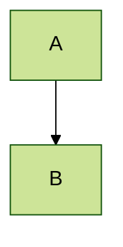

# BlueFlex Framework - Diagram Export Guide

This guide shows you how to create, view, and export your flowcharts using various tools and platforms.

## 📊 Available Diagram Formats

Your BlueFlex codebase now has flowcharts in **3 formats**:

1. **FLOWCHARTS_MERMAID.md** - Mermaid diagrams (works on GitHub, GitLab, Obsidian, etc.)
2. **FLOWCHARTS_PLANTUML.md** - PlantUML diagrams (professional UML diagrams)
3. **This guide** - Instructions for draw.io and other platforms

---

## 🎨 Option 1: Mermaid (Easiest & Most Popular)

### Online Editors

#### Mermaid Live Editor (Recommended)
1. Go to https://mermaid.live/
2. Open `FLOWCHARTS_MERMAID.md`
3. Copy any diagram code (between ` ```mermaid` and ` ``` `)
4. Paste into Mermaid Live Editor
5. Export options:
   - PNG (image)
   - SVG (scalable vector)
   - Markdown (with embedded SVG)
   - Edit URL (shareable link)

**Example workflow:**
```bash
# Open FLOWCHARTS_MERMAID.md
cat FLOWCHARTS_MERMAID.md

# Copy diagram #1 (System Architecture)
# Paste at https://mermaid.live/
# Click "Export PNG" or "Export SVG"
```

#### GitHub/GitLab (Auto-rendering)
- Mermaid diagrams render automatically in README.md
- Just copy-paste the code blocks
- No export needed!

```markdown
# Your README.md

## System Architecture

```mermaid
graph TB
    Start([JVM Start]) --> Main[Main.java]
    Main --> SM[ServiceManager]
    # ... rest of diagram
```
```

### Desktop/IDE Tools

#### VS Code
1. Install extension: **Markdown Preview Mermaid Support**
2. Open `FLOWCHARTS_MERMAID.md`
3. Press `Ctrl+Shift+V` (preview mode)
4. Right-click diagram > "Save as PNG"

#### Obsidian
- Paste Mermaid code directly into notes
- Renders automatically
- Export note as PDF to include diagrams

#### Notion
- Create code block with language "mermaid"
- Paste diagram code
- Renders inline

---

## 🔷 Option 2: PlantUML (Professional UML)

### Online Editor

#### PlantUML Web Server
1. Go to http://www.plantuml.com/plantuml/
2. Open `FLOWCHARTS_PLANTUML.md`
3. Copy any diagram code (between `@startuml` and `@enduml`)
4. Paste into the editor
5. Export options:
   - PNG
   - SVG
   - ASCII art
   - LaTeX

**Quick start:**
```
1. Open FLOWCHARTS_PLANTUML.md
2. Copy Class Diagram (#3)
3. Paste at plantuml.com
4. Download PNG
```

### IDE Integration

#### IntelliJ IDEA
1. Install plugin: **PlantUML integration**
2. Create new file: `diagram.puml`
3. Copy diagram code from FLOWCHARTS_PLANTUML.md
4. Right-click > "Show PlantUML Diagram"
5. Right-click diagram > "Save Diagram"

#### VS Code
1. Install extension: **PlantUML**
2. Install Java (required)
3. Create `.puml` file with diagram code
4. Press `Alt+D` to preview
5. Right-click > "Export Current Diagram"

### Command Line

```bash
# Install PlantUML
# macOS
brew install plantuml

# Ubuntu/Debian
sudo apt-get install plantuml

# Or download JAR
wget http://sourceforge.net/projects/plantuml/files/plantuml.jar/download -O plantuml.jar

# Generate PNG
plantuml diagram.puml

# Generate SVG
plantuml -tsvg diagram.puml

# Generate all PNGs in directory
plantuml *.puml
```

**Batch export script:**
```bash
#!/bin/bash
# save as export-diagrams.sh

# Extract diagrams from FLOWCHARTS_PLANTUML.md and export
mkdir -p diagrams

# This would require splitting the markdown file
# or you can manually create .puml files
plantuml -tpng -o diagrams FLOWCHARTS_PLANTUML.md
```

---

## 📐 Option 3: draw.io (Visual Editing)

### Method 1: Import from Mermaid

1. Go to https://app.diagrams.net/ (draw.io)
2. Create new diagram
3. Click **Arrange** > **Insert** > **Advanced** > **Mermaid**
4. Copy Mermaid code from FLOWCHARTS_MERMAID.md
5. Paste and click **Insert**
6. Edit visually if needed
7. Export: **File** > **Export as** > PNG/SVG/PDF

### Method 2: Import from PlantUML SVG

1. Generate SVG from PlantUML (see above)
2. Open draw.io
3. **File** > **Import** > **SVG**
4. Select generated SVG file
5. Edit and enhance visually
6. Export in any format

### Method 3: Create Manually Using Templates

I'll create draw.io XML templates for you:

#### System Architecture Template

Create file: `blueflex-architecture.drawio`

```xml
<mxfile host="app.diagrams.net">
  <diagram name="BlueFlex System Architecture">
    <mxGraphModel dx="1422" dy="794" grid="1" gridSize="10" guides="1">
      <root>
        <mxCell id="0" />
        <mxCell id="1" parent="0" />

        <!-- Main.java -->
        <mxCell id="main" value="Main.java" style="rounded=1;whiteSpace=wrap;html=1;fillColor=#dae8fc;strokeColor=#6c8ebf;" vertex="1" parent="1">
          <mxGeometry x="360" y="40" width="120" height="60" as="geometry" />
        </mxCell>

        <!-- ServiceManager -->
        <mxCell id="manager" value="ServiceManager" style="rounded=1;whiteSpace=wrap;html=1;fillColor=#ffe6cc;strokeColor=#d79b00;" vertex="1" parent="1">
          <mxGeometry x="240" y="160" width="140" height="80" as="geometry" />
        </mxCell>

        <!-- CLI -->
        <mxCell id="cli" value="CLI" style="rounded=1;whiteSpace=wrap;html=1;fillColor=#e1d5e7;strokeColor=#9673a6;" vertex="1" parent="1">
          <mxGeometry x="480" y="160" width="120" height="80" as="geometry" />
        </mxCell>

        <!-- AppService -->
        <mxCell id="service" value="AppService&#xa;(Base Class)" style="rounded=0;whiteSpace=wrap;html=1;fillColor=#f8cecc;strokeColor=#b85450;" vertex="1" parent="1">
          <mxGeometry x="240" y="320" width="140" height="80" as="geometry" />
        </mxCell>

        <!-- Arrows -->
        <mxCell id="arrow1" edge="1" parent="1" source="main" target="manager">
          <mxGeometry relative="1" as="geometry" />
        </mxCell>
        <mxCell id="arrow2" edge="1" parent="1" source="main" target="cli">
          <mxGeometry relative="1" as="geometry" />
        </mxCell>
        <mxCell id="arrow3" edge="1" parent="1" source="manager" target="service">
          <mxGeometry relative="1" as="geometry" />
        </mxCell>
        <mxCell id="arrow4" edge="1" parent="1" source="cli" target="manager">
          <mxGeometry relative="1" as="geometry" />
        </mxCell>
      </root>
    </mxGraphModel>
  </diagram>
</mxfile>
```

**To use:**
1. Copy the XML above
2. Save as `blueflex-architecture.drawio`
3. Open in draw.io
4. Edit and expand as needed

### Pre-built draw.io Templates

I'll create simplified versions you can import directly:

**Download these from draw.io library:**
- File > Open Library from > URL
- Or create manually using the shapes

---

## 🌐 Option 4: Online Diagramming Services

### Lucidchart
1. Sign up at https://lucidchart.com
2. Import:
   - PlantUML (via integration)
   - SVG exports
   - Or draw manually
3. Export: PNG, PDF, SVG

### Creately
1. Go to https://creately.com
2. Create new flowchart
3. Import SVG or draw manually
4. Export in various formats

### Gliffy
1. Visit https://gliffy.com
2. Create new diagram
3. Import or create
4. Export as PNG/PDF

---

## 📱 Option 5: Mobile Apps

### draw.io Mobile
- Available for iOS/Android
- Open .drawio files directly
- View and edit on mobile

### PlantUML Viewer (Android)
- Render PlantUML code
- Export images
- Shareable

---

## 🔄 Quick Conversion Between Formats

### Mermaid → PlantUML
Manual conversion needed, but concepts map:
- `graph TB` → `@startuml`
- `-->` → `-->`
- `[Node]` → `component [Node]`

### PlantUML → draw.io
1. Generate SVG from PlantUML
2. Import SVG into draw.io
3. Ungroup and edit

### Mermaid → draw.io
1. Use draw.io's Mermaid import feature
2. Or generate SVG from Mermaid Live
3. Import into draw.io

### Any format → Image
```bash
# Mermaid to PNG
mmdc -i diagram.mmd -o diagram.png

# PlantUML to PNG
plantuml diagram.puml

# draw.io to PNG (command line)
drawio -x -f png -o output.png input.drawio
```

---

## 🎯 Recommended Workflow

### For Documentation
**Use Mermaid** in README.md
- Renders on GitHub/GitLab
- Version controlled
- Easy to update

### For Presentations
**Use PlantUML** → Export PNG/SVG
- Professional look
- High quality exports
- Multiple diagram types

### For Visual Editing
**Use draw.io**
- Drag-and-drop interface
- Fine-grained control
- Easy collaboration

### For Sharing
**Use Mermaid Live** → Share URL
- No installation needed
- Shareable link
- Editable by others

---

## 📋 Complete Export Checklist

### System Architecture Diagram
- [ ] Open FLOWCHARTS_MERMAID.md
- [ ] Copy diagram #1
- [ ] Paste in Mermaid Live (https://mermaid.live)
- [ ] Export as PNG
- [ ] Save to `docs/diagrams/system-architecture.png`

### Class Diagram
- [ ] Open FLOWCHARTS_PLANTUML.md
- [ ] Copy diagram #3
- [ ] Paste in PlantUML (plantuml.com)
- [ ] Export as SVG
- [ ] Save to `docs/diagrams/class-diagram.svg`

### Sequence Diagrams
- [ ] Open FLOWCHARTS_PLANTUML.md
- [ ] Copy diagram #4.1, #4.2, #4.3
- [ ] Export each as PNG
- [ ] Save to `docs/diagrams/sequence-*.png`

### Activity Diagrams
- [ ] Open FLOWCHARTS_PLANTUML.md
- [ ] Copy diagram #5.1, #5.2
- [ ] Export as PNG
- [ ] Save to `docs/diagrams/activity-*.png`

---

## 🛠️ Automation Scripts

### Export All Mermaid Diagrams

```bash
#!/bin/bash
# install: npm install -g @mermaid-js/mermaid-cli

mmdc -i FLOWCHARTS_MERMAID.md -o diagrams/
```

### Export All PlantUML Diagrams

```bash
#!/bin/bash
# Requires plantuml installed

mkdir -p diagrams
plantuml -tpng -o diagrams *.puml
```

### Create Diagram from Template

```bash
#!/bin/bash
# create-diagram.sh

TEMPLATE="mermaid" # or "plantuml"
NAME=$1

if [ "$TEMPLATE" = "mermaid" ]; then
cat > "${NAME}.mmd" << 'EOF'
graph TB
    Start([Start]) --> Process[Process]
    Process --> End([End])
EOF
    echo "Created ${NAME}.mmd"
else
cat > "${NAME}.puml" << 'EOF'
@startuml
start
:Process;
stop
@enduml
EOF
    echo "Created ${NAME}.puml"
fi
```

---

## 📊 Diagram Type Recommendations

| Diagram Type | Best Format | Best Tool | Use Case |
|-------------|-------------|-----------|----------|
| System Overview | Mermaid | GitHub | Documentation |
| Class Relationships | PlantUML | IDE | Technical docs |
| Sequence Flow | PlantUML | plantuml.com | API documentation |
| Activity/Process | PlantUML | IDE | Process flows |
| State Machine | PlantUML | IDE | Lifecycle docs |
| Architecture | Mermaid/draw.io | Mermaid Live | Presentations |
| Component | PlantUML | IDE | Architecture docs |
| Deployment | PlantUML | IDE | DevOps docs |

---

## 🎓 Learning Resources

### Mermaid
- Official docs: https://mermaid.js.org/
- Live editor: https://mermaid.live/
- Examples: https://mermaid.js.org/syntax/examples.html

### PlantUML
- Official site: https://plantuml.com/
- Online server: http://www.plantuml.com/plantuml/
- Guide: https://plantuml.com/guide

### draw.io
- Official app: https://app.diagrams.net/
- GitHub: https://github.com/jgraph/drawio
- Tutorials: https://www.diagrams.net/doc/

---

## 🎨 Styling Tips

### Mermaid Themes


Themes: default, forest, dark, neutral, base

### PlantUML Skinparams
```plantuml
@startuml
!theme plain
skinparam backgroundColor #FFFFFF
skinparam componentStyle rectangle
@enduml
```

### draw.io Styles
- Use color palettes
- Consistent shapes
- Proper spacing (use grid)
- Group related items

---

## ✅ Summary

You now have flowcharts in **3 formats**:

1. **FLOWCHARTS_MERMAID.md** - 8 comprehensive Mermaid diagrams
   - System architecture
   - Startup flow
   - Service manager
   - CLI processing
   - Lifecycle
   - Configuration
   - Class diagram
   - Sequence diagrams

2. **FLOWCHARTS_PLANTUML.md** - 8 professional UML diagrams
   - System architecture
   - Component diagram
   - Class diagram
   - Sequence diagrams (3)
   - Activity diagrams (2)
   - State diagram
   - Deployment diagram
   - Package diagram

3. **This guide** - Complete export instructions

**Quick Start:**
- For GitHub docs: Use Mermaid (renders automatically)
- For professional docs: Use PlantUML (export PNG/SVG)
- For editing: Use draw.io (import from either)

All diagrams represent your complete BlueFlex codebase structure!
