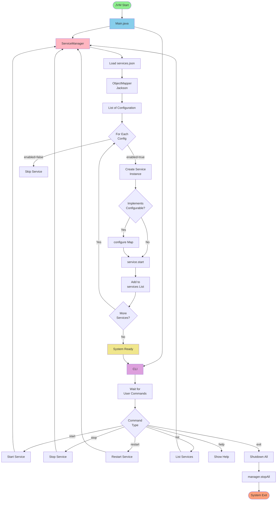
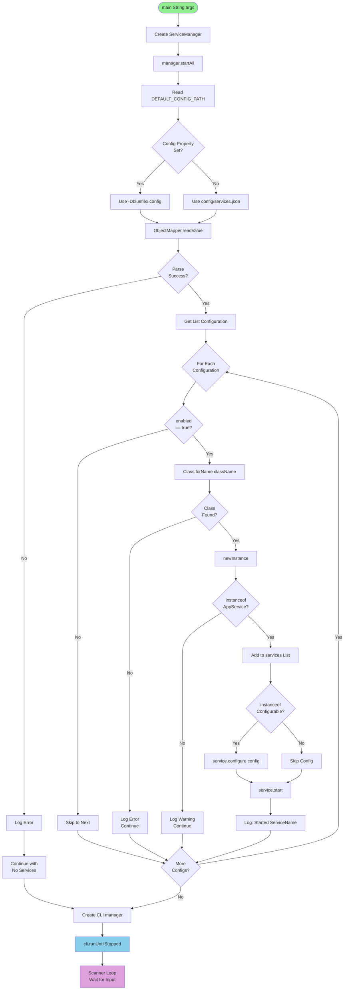
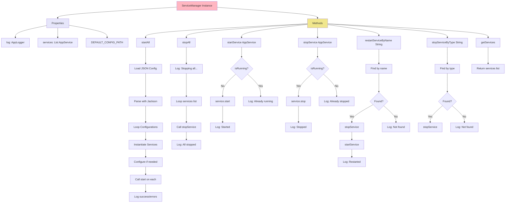
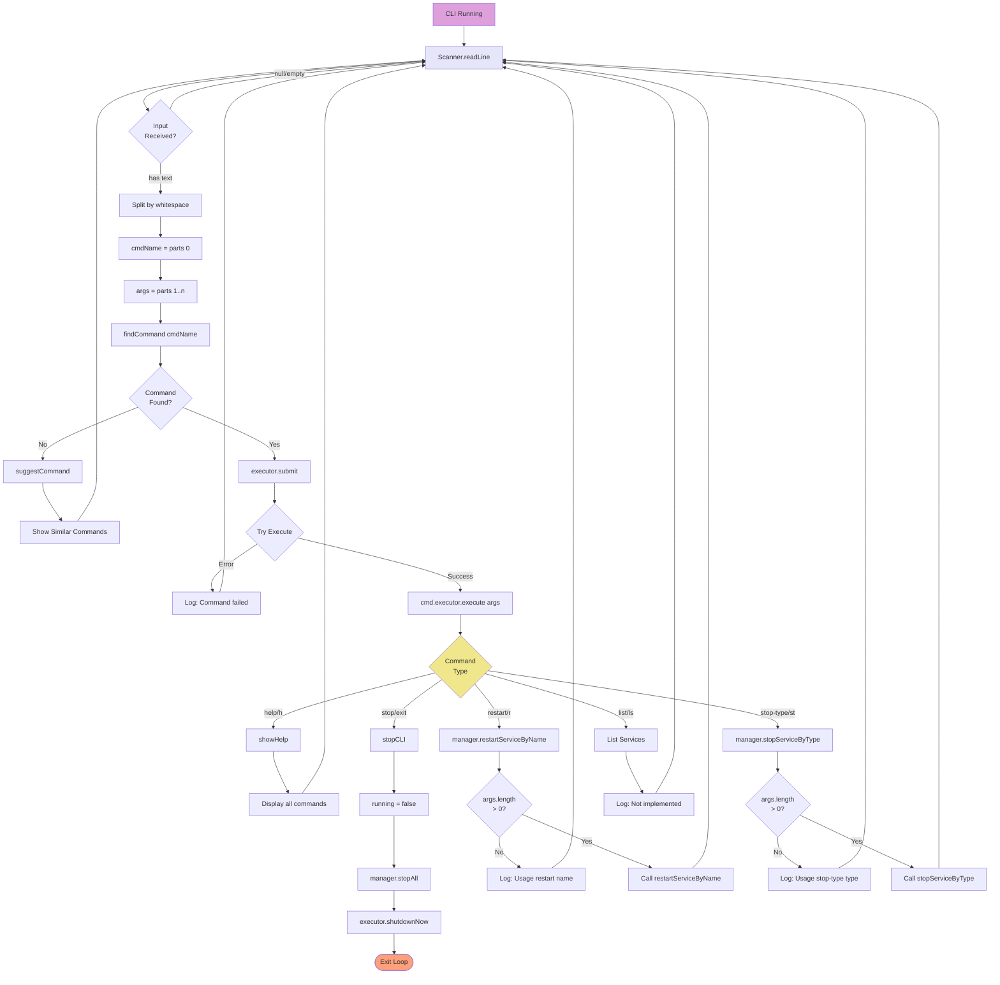
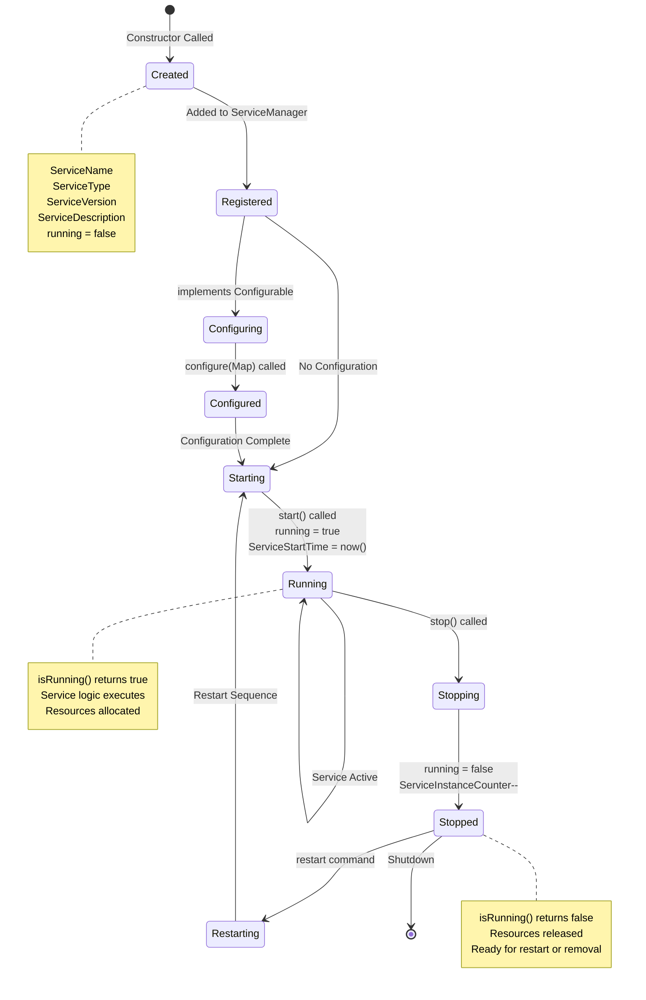
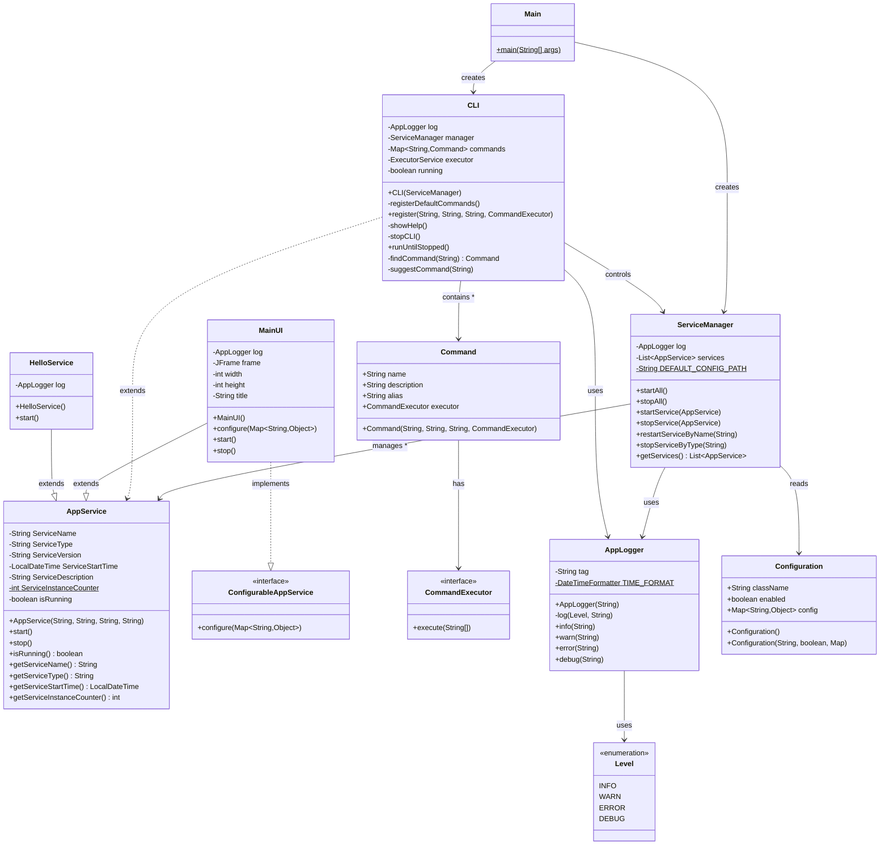
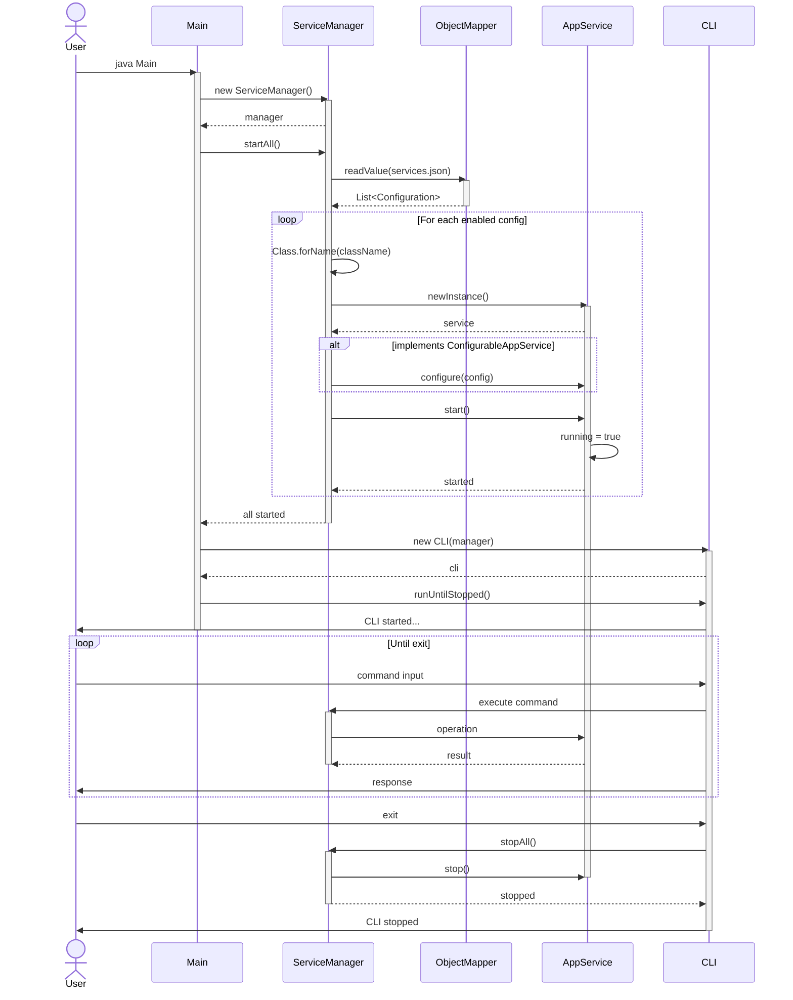
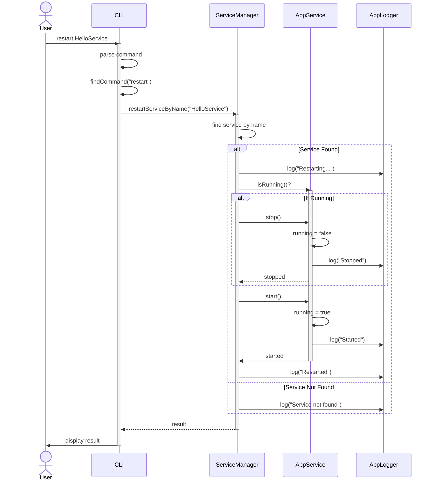
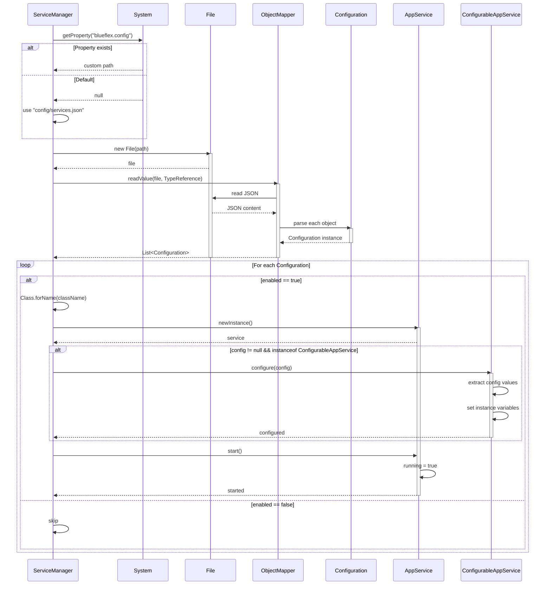

# BlueFlex Framework - Mermaid Flowcharts

> **How to use**: Copy any diagram code and paste into [Mermaid Live Editor](https://mermaid.live/) or any Mermaid-compatible tool (GitHub, GitLab, Notion, Obsidian, etc.)

## Table of Contents
1. [Complete System Architecture](#1-complete-system-architecture)
2. [Application Startup Flow](#2-application-startup-flow)
3. [Service Manager Flow](#3-service-manager-flow)
4. [CLI Command Processing](#4-cli-command-processing)
5. [Service Lifecycle](#5-service-lifecycle)
6. [Configuration Loading](#6-configuration-loading)
7. [Class Diagram](#7-class-diagram)
8. [Sequence Diagrams](#8-sequence-diagrams)

---

## 1. Complete System Architecture

---

## 2. Application Startup Flow

---

## 3. Service Manager Flow

---

## 4. CLI Command Processing

---

## 5. Service Lifecycle

---

## 6. Configuration Loading

```mermaid
flowchart LR
    A[services.json File] --> B[ServiceManager.startAll]

    B --> C{System Property<br/>blueflex.config?}
    C -->|Set| D[Use Custom Path]
    C -->|Not Set| E[Use config/services.json]

    D --> F[File Object]
    E --> F

    F --> G[ObjectMapper]
    G --> H[readValue with TypeReference]

    H --> I{Valid<br/>JSON?}
    I -->|No| J[Throw Exception]
    I -->|Yes| K[List Configuration]

    J --> L[Catch Block]
    L --> M[Log Error Message]
    M --> N[Return Empty List]

    K --> O[For Each Configuration]
    O --> P[Configuration Object]

    P --> Q[className: String]
    P --> R[enabled: boolean]
    P --> S[config: Map String,Object]

    Q --> T{Load Class}
    T -->|Success| U[Create Instance]
    T -->|Fail| V[Log Error<br/>Continue Loop]

    U --> W{instanceof<br/>ConfigurableAppService?}
    W -->|Yes| X[Call configure config]
    W -->|No| Y[Skip Configuration]

    X --> Z[Service Configured]
    Y --> Z
    Z --> AA[Call service.start]

    V --> AB{More<br/>Configs?}
    AA --> AB
    AB -->|Yes| O
    AB -->|No| AC[All Services Started]

    style A fill:#90EE90
    style K fill:#87CEEB
    style P fill:#FFB6C1
    style AC fill:#F0E68C
```

---

## 7. Class Diagram

---

## 8. Sequence Diagrams

### 8.1 System Startup Sequence

### 8.2 Service Restart Sequence

### 8.3 Configuration Loading Sequence

---

## How to Export These Diagrams

### Option 1: Mermaid Live Editor
1. Go to https://mermaid.live/
2. Copy any diagram code above
3. Paste into the editor
4. Export as:
   - PNG
   - SVG
   - Markdown
   - Or edit and save as .mmd file

### Option 2: GitHub/GitLab
- These diagrams render automatically in README.md files
- Just paste the code blocks

### Option 3: VS Code
- Install "Markdown Preview Mermaid Support" extension
- View diagrams in preview mode

### Option 4: Obsidian/Notion
- Paste code blocks directly (they support Mermaid)

### Option 5: draw.io Integration
1. Install draw.io desktop or use https://app.diagrams.net/
2. Use "Insert > Advanced > Mermaid" option
3. Paste the code
4. It will render as a diagram

---

## Quick Reference

- **System Flow**: Diagram #1 and #2
- **Service Management**: Diagram #3 and #5
- **CLI Processing**: Diagram #4
- **Configuration**: Diagram #6
- **Class Structure**: Diagram #7
- **Interactions**: Diagram #8

All diagrams are interconnected and represent different views of your BlueFlex framework!
