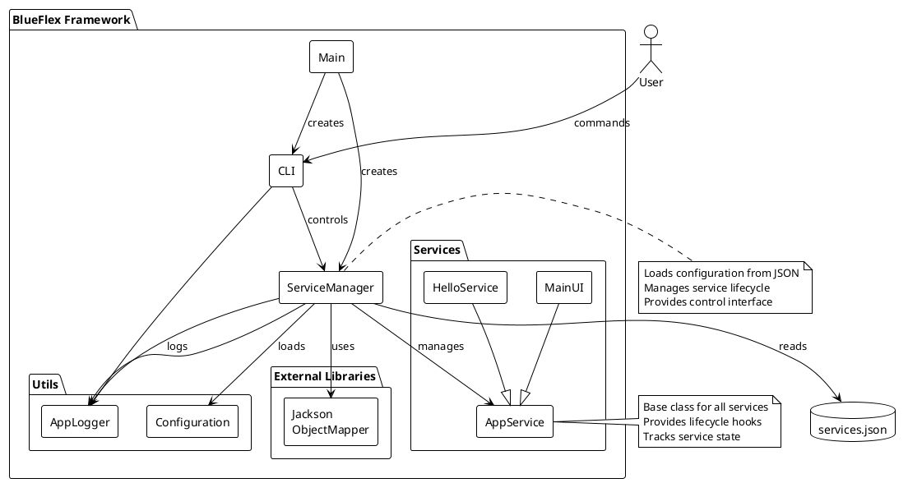
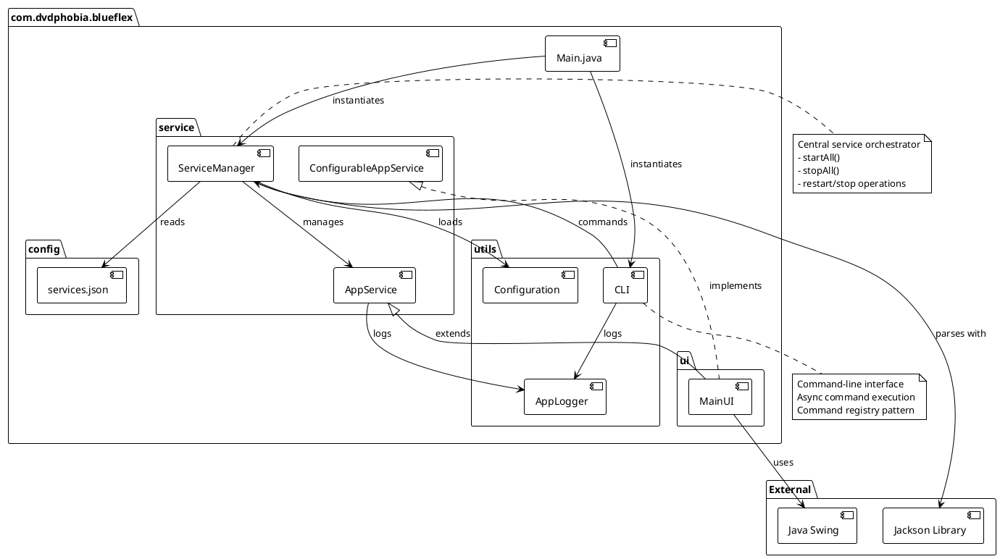
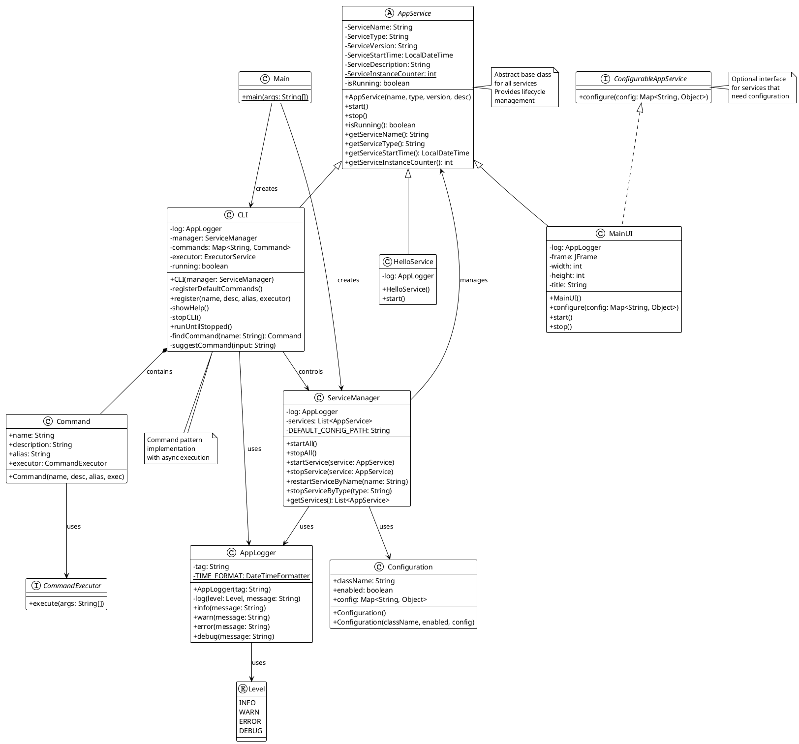
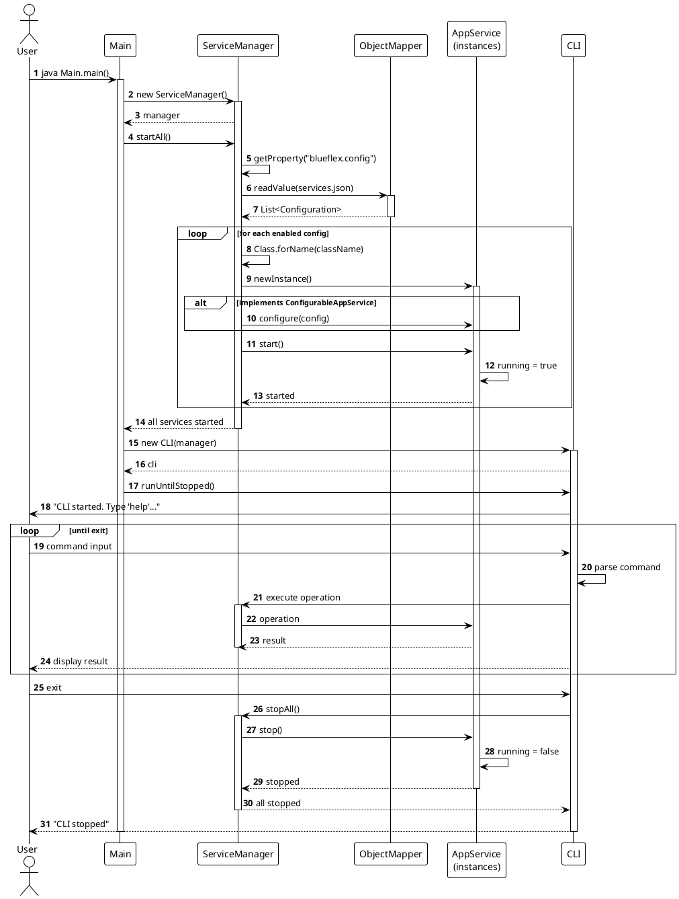
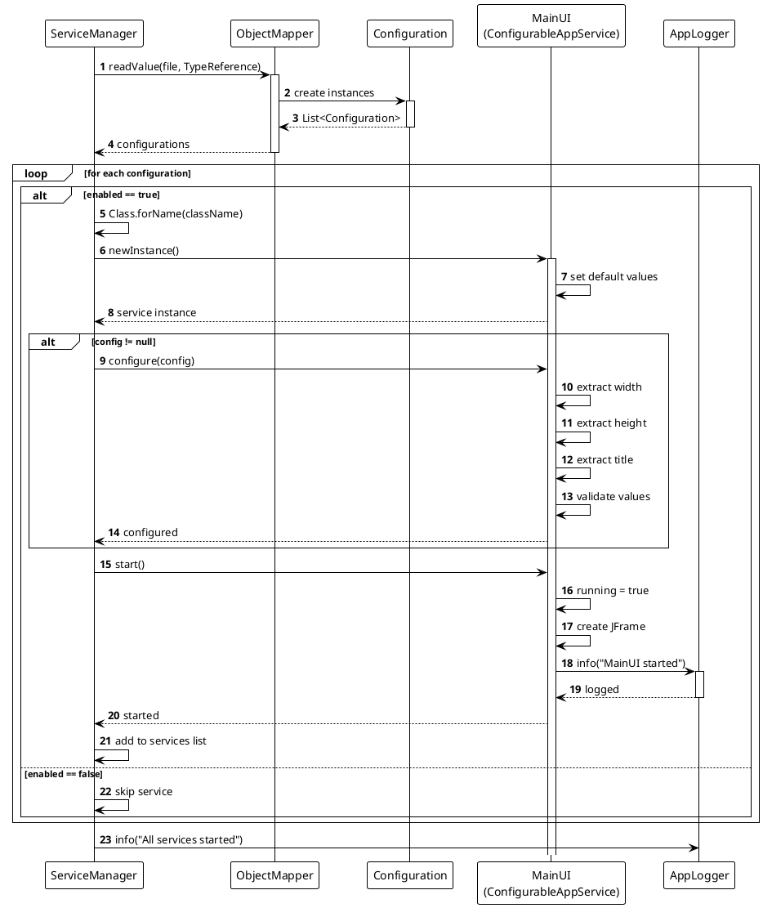
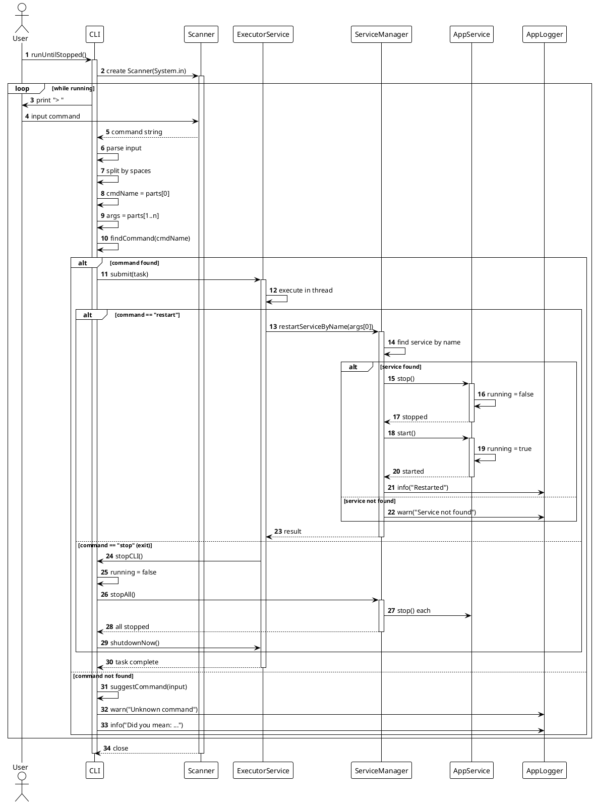
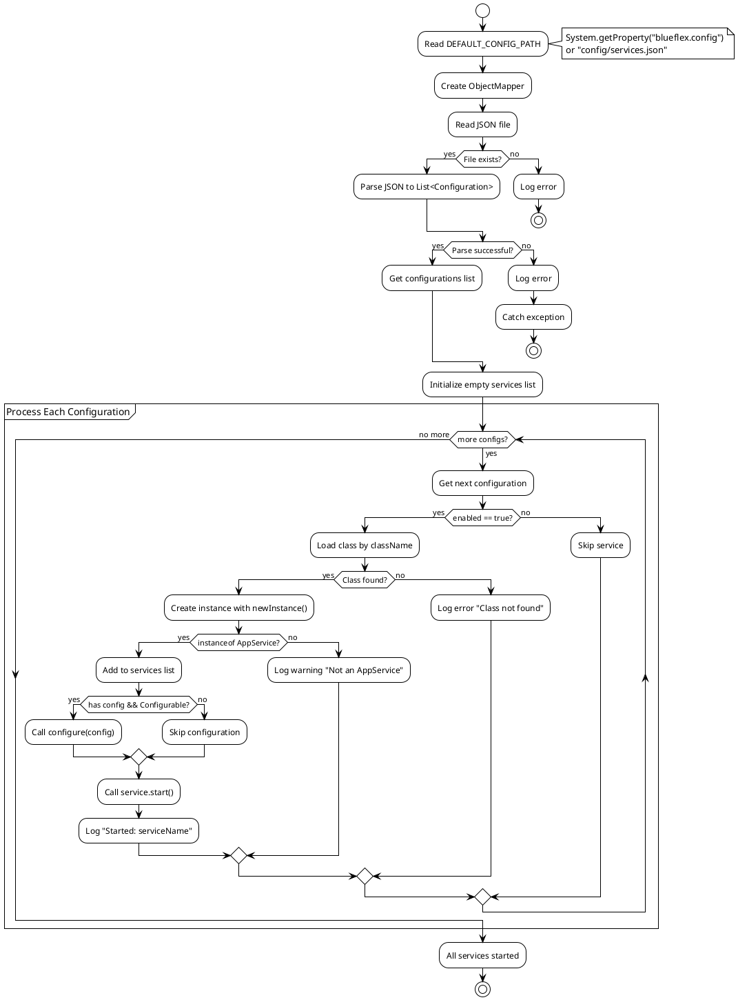
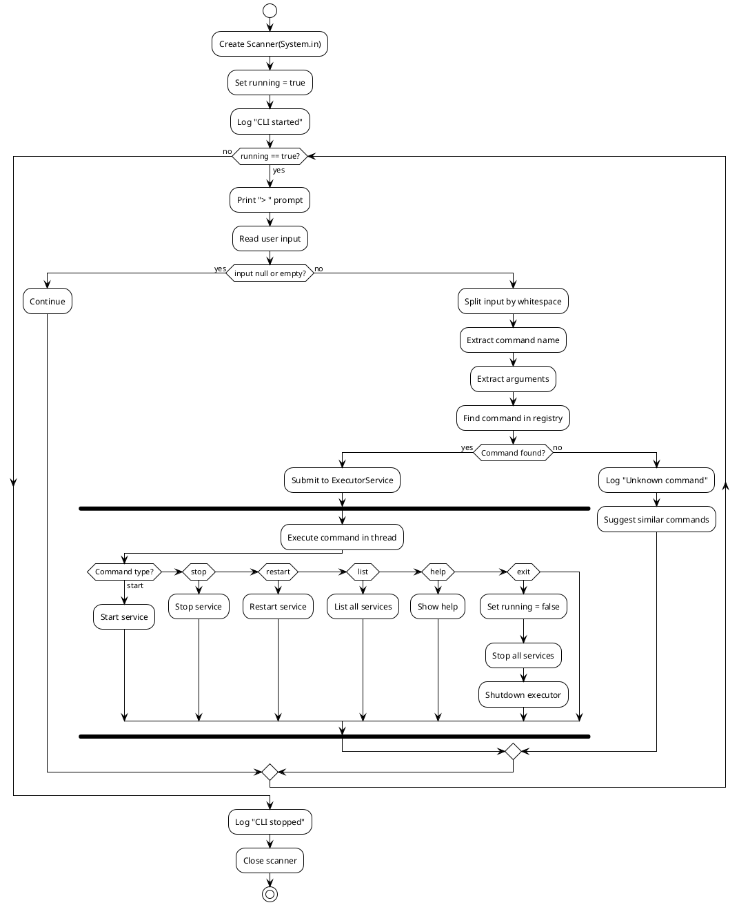
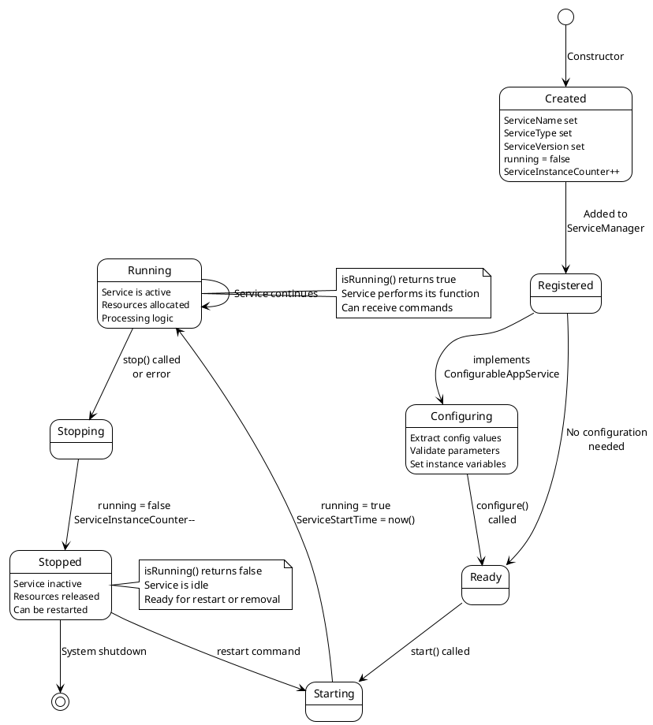
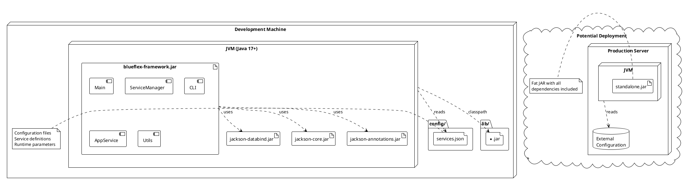

# BlueFlex Framework - PlantUML Diagrams

> **How to use**: Copy any diagram code and paste into [PlantUML Online Editor](http://www.plantuml.com/plantuml/) or use PlantUML locally/in IDE

## Table of Contents
1. [System Architecture](#1-system-architecture)
2. [Component Diagram](#2-component-diagram)
3. [Class Diagram](#3-class-diagram)
4. [Sequence Diagrams](#4-sequence-diagrams)
5. [Activity Diagrams](#5-activity-diagrams)
6. [State Diagram](#6-state-diagram)
7. [Deployment Diagram](#7-deployment-diagram)

---

## 1. System Architecture



---

## 2. Component Diagram



---

## 3. Class Diagram



---

## 4. Sequence Diagrams

### 4.1 System Startup



### 4.2 Service Configuration



### 4.3 CLI Command Processing



---

## 5. Activity Diagrams

### 5.1 ServiceManager.startAll()



### 5.2 CLI Command Loop



---

## 6. State Diagram



---

## 7. Deployment Diagram



---

## 8. Package Diagram

```plantuml
@startuml BlueFlex_Package_Diagram
!theme plain

package "com.dvdphobia.blueflex" {

    class Main

    package "service" {
        abstract class AppService
        interface ConfigurableAppService
        class ServiceManager
    }

    package "utils" {
        class CLI
        class AppLogger
        class Configuration
        enum Level
    }

    package "ui" {
        class MainUI
    }

    package "config" {
        file services.json
    }

    package "network" {
        class NetworkHandler
    }

    package "API" {
        class Read
    }

    package "core" {
        note "Future expansion\nFramework core features" as N1
    }
}

package "External Libraries" {
    package "com.fasterxml.jackson" {
        class ObjectMapper
        class TypeReference
    }

    package "javax.swing" {
        class JFrame
    }
}

Main --> service
Main --> utils
service --> utils
utils --> service
ui --> service
ui --> utils
ui --> javax.swing
service --> com.fasterxml.jackson
service --> config

@enduml
```

---

## How to Use PlantUML Diagrams

### Option 1: Online Editor
1. Go to http://www.plantuml.com/plantuml/
2. Copy any diagram code above
3. Paste into the editor
4. Export as PNG, SVG, or other formats

### Option 2: VS Code
1. Install "PlantUML" extension
2. Install Java (required for PlantUML)
3. Create `.puml` file with diagram code
4. Press `Alt+D` to preview

### Option 3: IntelliJ IDEA
1. Install "PlantUML integration" plugin
2. Create `.puml` file
3. Right-click > "Show PlantUML Diagram"

### Option 4: Command Line
```bash
# Install PlantUML
brew install plantuml  # macOS
# or download plantuml.jar

# Generate PNG
plantuml diagram.puml

# Generate SVG
plantuml -tsvg diagram.puml
```

### Option 5: Convert to draw.io
1. Generate SVG from PlantUML
2. Open draw.io
3. File > Import > Select SVG file

---

## Diagram Types Quick Reference

- **System Architecture**: High-level system view
- **Component Diagram**: Module relationships
- **Class Diagram**: Object-oriented structure
- **Sequence Diagrams**: Interaction flows
- **Activity Diagrams**: Process flows
- **State Diagram**: Service lifecycle states
- **Deployment Diagram**: Physical architecture
- **Package Diagram**: Code organization

All diagrams are in PlantUML format and can be exported to any image format!
